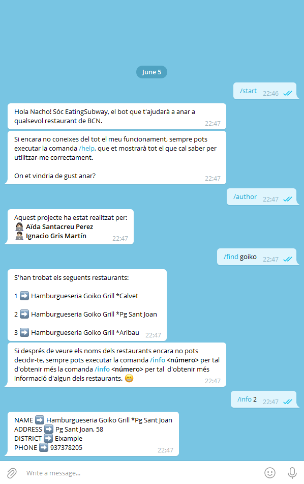
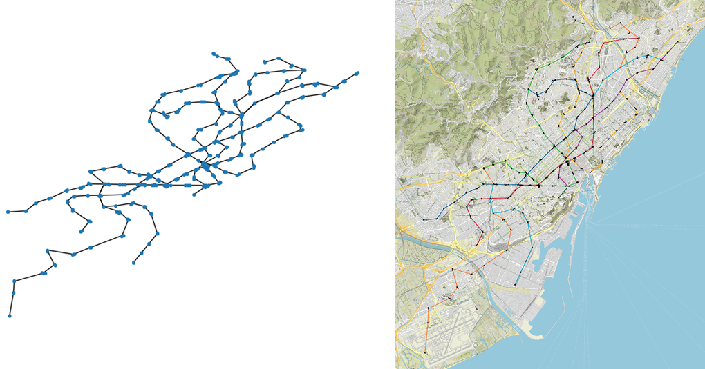
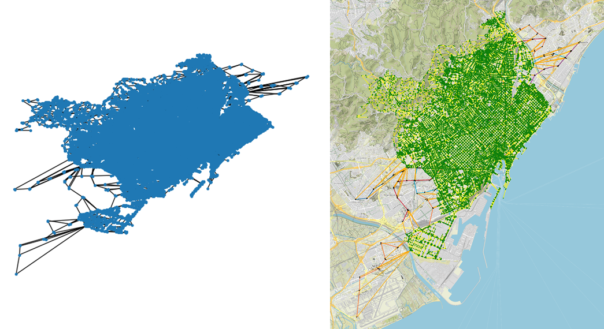
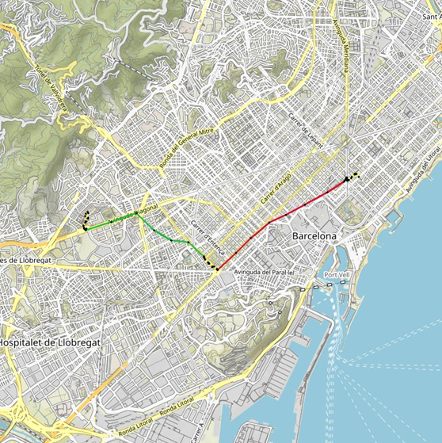

# Pràctica 2 AP2 - MetroNyam

**EatingSubway** et permetrà anar a qualsevol restaurant en el menor temps possible! 🍽

## Introducció

Aquest projecte tracta en implementar un bot de Telegram que ajudi a l'usuari a anar fins al restaurant de Barcelona que desitgi en el menor temps possible, ja sigui a peu o en metro.



Per tal de fer-ho, s'han creat diversos mòduls connectats entre ells, cadascún d'ells encarregat d'algunes de les funcionalitats que inclou el projecte. Els mòduls implementats han estat el `restaurants.py`, el `metro.py`, el `city.py` i el `boy.py`. Tots ells s'explicaran en detall més endevant.

## Indicacions i funcionament del projecte

Per tal de poder utilitzar el bot de Telegram desenvolupat cal que l'usuari tingui descarregada l'aplicació Telegram en el dispositiu que vagi a utilitzar. Un cop descarregada, l'usuari haurà de crear-se un compte i cercar al buscador el nom del bot, `EatingSubway`.

Un cop es tingui el bot a l'apartat de xats, ja es podrà començar a utilitzar correctament seguint les següents indicacions.

En primer lloc, cal remarcar que per tal de poder iniciar la conversa amb el bot, aquest s'haurà d'executar. Únicament quan el bot estigui en actiu es podra utilitzar. Un cop en actiu, es pot iniciar la conversa amb el bot amb la comanda `/start`. El bot fa una sèrie d'inicialitzacions en executar-se, pel que es possible que, sobretot el primer cop, trigui una estona en rebre la comanda `/start`.

A continuació, amb la conversa ja iniciada, es podrà seguir utilitzant el bot amb alguna de les comandes disponibles.

### Comandes disponibles

- `/help` Mostra un missatge a l'usuari amb totes les comandes disponibles i informació sobre el que fan i com utilitzar-les.
- `/author` Mostra el nom de les dues persones que han dut a terme el projecte.
- `/find <query>` Mostra una llista amb els restaurants que satisfan la cerca de l'usuari (Fins a un màxim de 12).
- `/info <number>` Mostra informació extra sobre el restaurant especificat. El nombre que s'ha de passar com a paràmetre és el que es mostra amb la comanda `/find <query>` al costat del restaurant.
- `/guide <number>` Mostra, en una imatge, el camí més curt per anar al restaurant especificat a peu i/o en metro. El nombre que s'ha de passar com a paràmetre és el que es mostra amb la comanda `/find <query>` al costat del restaurant.
- `/time <number>` Mostra el temps aproximat, en minuts, que es triga a arribar al restaurant especificat desde la posició de l'usuari. El nombre que s'ha de passar com a paràmetre és el que es mostra amb la comanda `/find <query>` al costat del restaurant.
- `/accessibility <yes/no>` Serveix per indicar si l'usuari requereix d'accessibilitat especial.

Algunes d'aquestes comandes necessiten que l'usuari comparteixi la seva **localització**. És molt important seguir aquesta indicació ja que sinó no s'executarà la comanda. De totes formes, el bot ja indica el motiu de l'error amb un missatge i l'informa de com continuar.

## Requeriments

Per tal de poder utilitzar el bot i totes les seves funcionalitats de forma correcta cal, abans de res, instal·lar un seguit de llibreries. Totes aquestes llibreries es troben al fitxer `requeriments.txt`, que es troba juntament amb la resta de fitxers del projecte.

Per tal d'instal·lar les llibreries del document, cal executar la següent comanda a la terminal:

`pip3 install nom_llibreria`

A banda de les llibreries que s'indiquen a la pràctica s'ha utilitzat la llibreria `fuzzywuzzy`, que es pot instalar amb la següent linia de comandes:

`pip3 install fuzzywuzzy`

## Funcionalitat dels mòduls
### Mòdul `restaurants`

El mòdul restaurants és l'encarregat de llegit el fitxer `restaurants.csv` i passar el seu contingut a un `Data Frame` utilitzant `pandas` amb el qual podrem treballar correctament. També s'encarrega de realitzar la cerca que l'usuari demani.

La informació de cada restaurant que llegim es guarda en una variable de tipus `Restaurant` que s'ha definit de la següent forma.

```python3
@dataclass
class Restaurant: ...
```
De la mateixa forma hem definit una variable de tipus `Restaurants` que denota una llista de `Restaurant` de la següent forma:

```python3
Restaurants: TypeAlias = List[Restaurant]
```

A més inclou diverses funcions que altres mòduls utilitzaran per tal de dur a terme algunes funcions del projecte.

La funció `read` s'encarrega de llegir el fitxer `restaurants.csv` i tractar la informació del `Data Frame` mencionat abans.

```python3
def read() -> Restaurants: ...
```

Per tal de trobar els restaurants que satisfan una determinada cerca utilitzem la funció `find_logic`.

```python3
def find_logic(query: str, restaurants: Restaurants) -> Restaurants: ...
```

Aquesta darrera funció fa servir la funcio `evaluate` per evaluar la cerca lògica i saber quins restaurants la compleixen.

```python3
def evaluate(query: List, cont: List, restaurant: Restaurant,
             ratio: List) -> bool: ...
```

 Alhora, aquesta última funció crida la funció `find` per comprovar si un restaurant compleix un únic requisit donat.

 ```python3
 def find(query: str, rest: Restaurant, ratio: List) -> bool: ...
 ```

A més, s'ha creat una funció que encapçala les dues primeres. Aquesta funció crida a la funció `read` i després fa la cerca sobre la llista que hagi retornat.

```python3
def get_restaurants(query: str) -> Restaurants: ...
```

### Mòdul `metro`

El mòdul `metro` és l'encarregat de generar el graf del metro de Barcelona. Per fer-ho, llegeix dos fitxer `estacions.csv` i `accessos.csv` a partir dels quals genera el graf.

El graf del metro de Barcelona es guarda en una variable de tipus `MetroGraph` definida de la següent forma usant el paquet `networkx` de Python (cal notar que s'utilitza `nx` com a abreviació del paquet).

```python3
MetroGraph: TypeAlias = nx.Graph
```

La informació obtinguda a partir d'aquests fitxers es guarda en dues variables diferents de tipus `Station` i `Access` definides de la següent forma.

```python3
@dataclass
class Station: ...

#dataclass
class Access: ...
```
De la mateixa forma que s'ha fet amb els restaurants, s'han definit dues variables per denotar les llistes que continguin variables de tipus `Station` i `Access`.

```python3
Stations: TypeAlias = List[Station]
Accesses: TypeAlias = List[Access]
```

Per tal de llegir els fitxers de tipus `csv` mencionats s'utilitzen les funcions `read_stations` i `read_accesses`

```python3
def read_stations() -> Stations: ...
def read_accesses() -> Accesses: ...
```

A més, el mòdul inclou tres funcions principals `get_metro_graph`, `show` i `plot`.

```python3
def get_metro_graph(special_access: bool) -> MetroGraph: ...
def show(g: MetroGraph) -> None: ...
def plot(g: MetroGraph, filename: str) -> None: ...
```

La funció `get_metro_graph` s'encarrega de la creació del graf del metro. Aquesta funció s'explicarà més en detall a continuació. La funció `show` mostra, en el navegador, una finestra interactiva en la que podrem observar el graf de metro. La funció `plot` genera una imatge del metro de Barcelona usant `staticmap` i la desa amb el nom indicat a la variable `filename`.



La funció `get_metro_graph` esta composada per diverses funcions que simplifiquen la lectura i estructura. La variable booleana `special_access` serveix per indicar si l'usuari requereix d'accessibilitat especial.

Les funcions `add_stations` i `add_accesses` afegeixen les estacions i els accessos al graf com a nodes identificats amb un `ID` únic.

```python3
def add_stations(metro: MetroGraph, stations_list: Stations) -> None: ...
def add_accesses(metro: MetroGraph, accesses_list: Accesses, stations_list: Stations, special_acess: bool) -> None: ...
```
A més, a l'hora, es van creant les arestes del graf amb les funcions següents.

```python3
def add_edge_tram(metro: MetroGraph, act_station: Station, prev_station: Station) -> None: ...
def add_edge_link(metro: MetroGraph, node: Station, act_station: Station) -> None: ...
def add_edge_access(metro: MetroGraph, station: Station, act_access: Access) -> None: ...
```
Cadascuna de les tres funcions afegeix un tipus d'aresta diferent. Les de tram corresponen a la primer funció. Les d'enllaç corresponen a la segona funció. Per últim, les de tipus accès corresponen a la tercera funció.

A l'hora d'afegir qualsevol aresta, se li passen uns determinats atributs que seràn necessaris per altres funcions d'altres mòduls.

## Mòdul `city`

El mòdul city és l'encarregat de crear el graf de la ciutat de Barcelona a partir del graf de metro obtingut amb el mòdul `metro` i un graf dels carrer de la ciutat que s'obté amb el paquet `osmnx`.

En aquest mòdul s'han definit els següents tipus de variables.

```python3
CityGraph: TypeAlias = nx.Graph
OsmnxGraph: TypeAlias = nx.MultiDiGraph
Coord: TypeAlias = Tuple[float, float]
NodeID: TypeAlias = Union[int, str]
Path: TypeAlias = List[NodeID]
```

Les principals funcions del mòdul són les següents:

```python3
def get_city_graph(special_acess: bool) -> CityGraph: ...
def show(g: CityGraph) -> None: ...
def plot(g: CityGraph, filename: str) -> None: ...
def find_path(ox_g: OsmnxGraph, g: CityGraph, src: Coord, dst: Coord) -> Path: ...
def plot_path(g: CityGraph, p: Path, filename: str) -> None: ...
```

La funció `get_city_graph` és l'encarregada de generar el graf de Barcelona. Per fer-ho, cridarà a la funció `get_metro_graph` del mòdul `metro`. El significat de la variable `special_access` és el mateix que per la funció `get_metro_graph`.

Com obtenir el graf dels carrers de Barcelona amb el paquet `osmnx` és una operació llarga, s'ha utilitzat el paquet `pickle` per tal de fer-ho de forma més eficient. Per fer-ho s'han utilitzat les funcions següents.

```python3
def load_osmnx_graph(filename: str) -> OsmnxGraph: ...
def save_osmnx_graph(g: OsmnxGraph, filename: str) -> None: ...
def get_osmnx_graph() -> OsmnxGraph: ...
```

Aquest mateix procés s'ha fet amb el graf del metro.

Les funcions `show` i `plot` serveixen per representar el graf de forma gràfica. La funció `show` mostra el graf al navegador de forma interactiva, mentre que la funció `plot` desa el graf com una imatge usant `staticmap`.



Finalment, la funció `find_path` s'encarrega de trobar el camí més curt (en temps) per arribar d'un punt de la ciutat a un altre. Per fer-ho s'utiliza la funció `dijkstra_path`, que ja ve implementada amb el paquet `networkx`. La funció `plot_path` mostra, de la mateixa manera que ho fa la funció `plot`, el camí trobat amb la anterior funció.



Per tal de generar el graf de la ciutat, s'utilitzen funcions auxiliars que faciliten la lectura del codi. Aquestes ajunten els dos grafs obtinguts (el de carrers i el de metro) i afegeixen les arestes restants entre els diferents accessos i els nodes de carrer més propers a ells.

Les funcions auxiliars que s'han creat han estat les següents.

```python3
def speed_by_type(type: str) -> float: ...
def add_g2_graph(g: CityGraph, g2: MetroGraph) -> None: ...
def add_g1_graph(g: CityGraph, g1: OsmnxGraph) -> None: ...
def get_closest_street(node: NodeID, g2: MetroGraph, g1: OsmnxGraph) -> NodeID: ...
def add_remaining_edges(g: CityGraph, g1: OsmnxGraph, g2: MetroGraph) -> None: ...
def build_city_graph(g1: OsmnxGraph, g2: MetroGraph) -> CityGraph: ...
```

Totes les arestes d'aquest graf tenen com a atributs una variable de tipus `Edge` i el pes de l'aresta (temps que es triga en recórrer l'aresta). La variable de tipus `Edge` s'ha declarat de la següent forma.

```python3
@dataclass
class Edge: ...
```

## Mòdul `bot`

La majoria del funcionament d'aquest mòdul s'ha explicat a l'apartat **Indicacions i funcionament del projecte**, ja que és amb el bot amb qui es comunicarà l'usuari. No obstant cal fer algunes aclaracions sobre la seva implementació.

En primer lloc, cal dir que és de vital importància tenir el fitxer `token.txt`, que conté el `TOKEN` necessari per identificar el bot, en el mateix directori en el que s'estigui executant el programa a l'hora d'activar al bot. En cas de tenir el fitxer en un altre directori, caldria canviar el `path` actual pel corresponent.

La inicialització dels grafs de carrers, `ox_g`, i de la ciutat, `city_graph`, es fa justament en iniciar el bot. Per aquest motiu, és bastant probable que els primers cops que s'executi el bot, aquest trigui una mica en respondre a la primera comanda enviada per l'usuari. Aquestes variables estan declarades com `globals`, per tal de poder utilitzar-les en totes les funcions que ho requereixin. A més, durant la inicialització, es crea una variables de tipus `Restaurants` i una tupla de dues variables de tipus `Coord` (localització) individuals per tal de no confondre les peticions de cada usuari.

```python3
context.user_data['restaurants']: restaurants.Restaurants = []
context.user_data['location']: Tuple[Coord, Coord] = None
```

Les funcions principals del bot són les següents.

```python3
def start(update, context): ...
def help(update, context): ...
def author(update, context): ...
def find(update, context): ...
def info(update, context): ...
def guide(update, context): ...
```

A banda d'aquestes funcions, s'ha implementat una adicional per tal de poder saber, en tot moment, el temps aproximat per anar a algún dels restaurants que satisfacin la cerca de l'usuari. Aquesta és la funció `time`.

```python3
def time(update, context):
```

Totes les funcions del mòdul `bot` tenen els seus `asserts` corresponents per tal de poder notificar a l'usuari en cas que aquest realitzi alguna acció no permesa. Aquestes notificacions es mostren de dues formes. En primer lloc, amb un missatge a l'usuari a través de l'apliació Telegram. A més, també es mostra per terminal un curt missatge que identifica el problema.


## Informació adicional

A la pràctica s'han afegit certes funcionalitats opcionals. Aquest apartat del README tracta de reflectir-les i explicar-les per tal d'aclarir el funcionament del bot.

Es començarà parlant del mòdul `restaurants`. Per tal de dur a terme la cerca s'ha implementat tant la **cerca lògica** com la **cerca difusa**. La cerca difusa no requereix d'un ús especial, doncs simplement tracta la cerca de paraules semblants a la cerca de l'usuari. Per tal d'usar la cerca lògica si que cal fer un ús especific.

Els operadors disponibles són `and`, `or`, `not`. Els primers dos aniran acompanyats de dues cerques simples, és a dir, de dues paraules. El tercer, `not`, nomès anirà acompanyat d'un paràmetre. Un possible exemple de cerca lògica podria ser, per exemple.

`and(or(piza,hamburg), eixample)`

Cal notar que les paraules no estan ben escrites perquè s'utilitza la cerca difusa.

Al mòdul `metro`, es pot veure que la funció `get_metro_graph` accepta un paràmetre booleà per tal d'indicar el requeriment d'accessibilitat de l'usuari. Aquest paràmetre serveix per tal de saber quins accessos cal o no afegir al graf a l'hora de crear-lo. Quan es requereix un accès especial hi ha alguns accessos que no s'afegeixen.

Al mòdul `city` s'ha fet una adaptació per tal d'obtenir el temps de trajecte per cada aresta. S'observa que hi ha una funció `speed_by_type` que retorna la velocitat a la que es mouria l'usuari en funció de si va a peu o en metro. Les dades de velocitats han estat extretes d'internet. A banda d'això, per tal d'obtenir una aproximació més real, s'ha afegit un retard de 3 minuts pels transbords.

A banda d'això, cal especificar la llegenda dels mapes que es dibuixen amb `staticmaps`. Els trams de metro estan dibuixats amb el color corresponent a la linia que utilitza l'usuari. Pels trams de transbord, s'utilitza un color rosa clar. Finalment, pels trams de peu (al carrer) s'utilitza el color negre.

Finalment, es parlarà del mòdul `bot`. S'han afegit dues funcions a les demanades. La primera de totes es la funció `time`, que retorna el temps estimat per tal d'arribar al restaurant indicat. La segona és la funció `accessibility`, que serveix per especificar el requeriment d'accès de l'usuari.

Es pot veure que per tal de fer el show (a una finestra interactiva) s'ha afegit el següent a les importacions de llibreries:

```python3
import matplotlib as mlt
mlt.use('WebAgg')
```

Això serveix per tal de poder veure el graf tant del metro com de la ciutat de forma interactiva a un navegador. S'ha fet d'aquesta forma perquè als dos components del grup ens donava problemes a l'hora de fer-ho de la forma convencional.

Per tal d'anar veient el comportament del bot (inicilització, errors, etc.) es van mostrant per la terminal alguns dels processos i errors.

## Autors

Aïda Santacreu Perez i Ignacio Gris Martín

Universitat Politècnica de Catalunya, 2022
